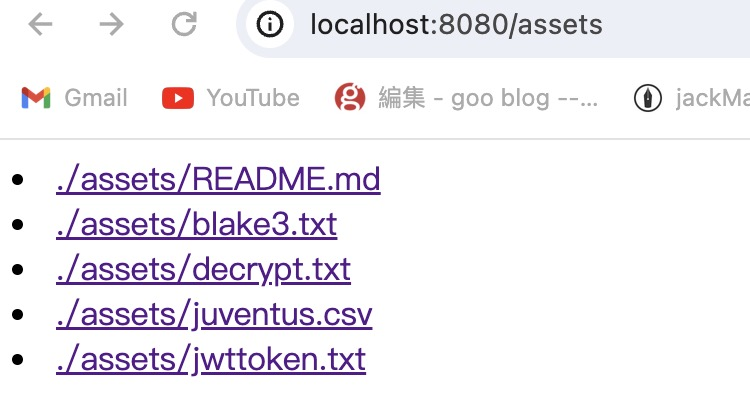

## 作业一
阅读 chacha20poly1305 文档，了解其使用方法并构建 CLI 对输入文本进行加密 / 解密
要求：

rcli text encrypt -key"xxx"> 加密并输出 base64
rcli text decrypt -key"XXX" >base64 > binary> 解密文本
### 相关代码见：
[text.rs](./src/process/text.rs)

## 作业二
json web token(jwt) 在用户验证领域经常被用到。请构建一个 CLI 来为给定 sub/aud/exp/… 生成一个 jwt。要求生成的 jwt 可以通过 jwt.io 的验证。

CLI：

rcli jwt sign --sub acme --aud device1 --exp 14d
rcli jwt verify -t
### 相关代码见
[jwt.rs](./src/process/jwt_convert.rs)

## 作业三
给课程里的 HTTP 文件服务器添加对 directory index 的支持。
### 运行截图

